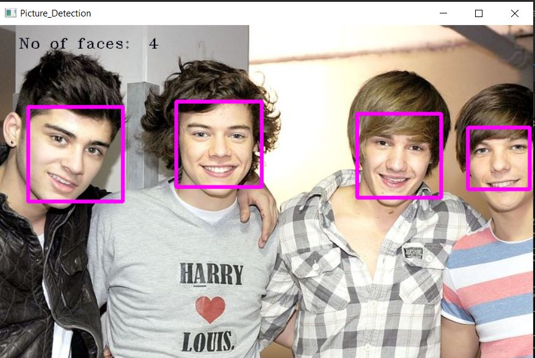

<h1 align="center"><span style="color: #FFFFFF;">Reconhecimento Facial em Tempo Real - OpenCV 4.10.0 & C++</span></h1>


## Descrição

Este projeto consiste em um sistema de reconhecimento facial em tempo real usando a biblioteca OpenCV e a linguagem de programação C++. O programa é capaz de reconhecer e manipular rostos em uma transmissão ao vivo pela webcam ou em imagens estáticas.

### Funcionalidades

- Reconheça e manipule os rostos usando o sistema de aplicação de reconhecimento facial.
  - O programa reconhece rostos em uma transmissão ao vivo pela webcam.
  - Usando classificadores XML pré-treinados.
  - Classificadores HaarCascades.
  - Carregar imagens para detecção de múltiplos rostos

<br>

<div align="center">


</div>

## Requisitos

- OpenCV 4.10.0 (https://opencv.org/releases/)
- C++ Compiler (recomenda-se GCC ou MinGW para Windows)
- Visual Studio Code (ou qualquer outro editor de código)

## Instalação

1. Certifique-se de ter o OpenCV 4.10.0 instalado no seu sistema.
2. Instale um compilador C++ (por exemplo, GCC ou MinGW para Windows).
3. Baixe ou clone este repositório para o seu sistema.
4. Compile o código-fonte usando o seu compilador C++ preferido.

## Como Usar

1. Abra o terminal na pasta do projeto.
2. Compile o código-fonte com o comando:

```bash
g++ -std=c++11 -o Facial_Recognition Facial_Recognition.cpp -I /caminho/para/o/OpenCV/include -L /caminho/para/as/bibliotecas/OpenCV -lopencv_world451 -lopencv_core451 -lopencv_imgproc451 -lopencv_highgui451
```

Certifique-se de substituir "/caminho/para/o/OpenCV/include" e "/caminho/para/as/bibliotecas/OpenCV" pelos caminhos corretos onde o OpenCV está instalado no seu sistema.

3. Execute o programa compilado.

## Exemplo de Uso

```bash
./Facial_Recognition
```

# Características

<div align="center"></div>

<br>

# Contribuições e Diretrizes Comunitárias

[](/LICENSE)
[](/CONTRIBUTING.md)
[](/CODE_OF_CONDUCT.md)